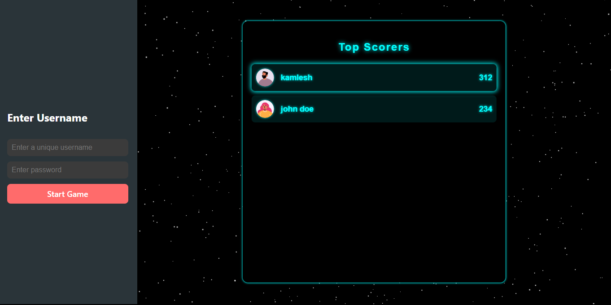
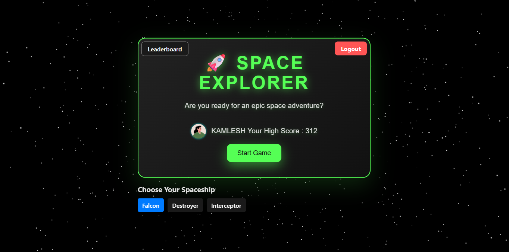
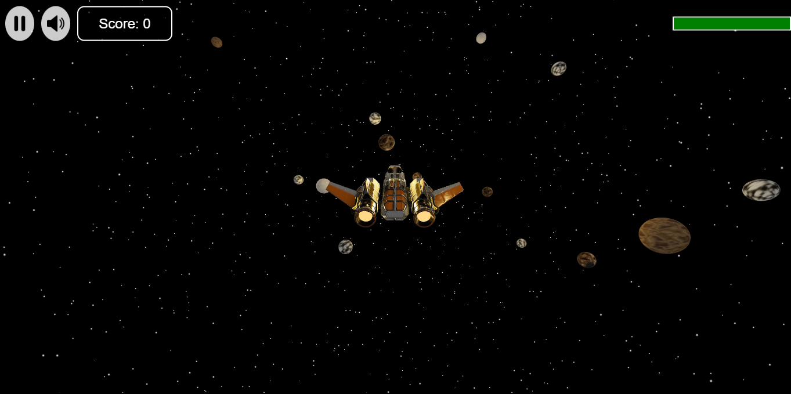
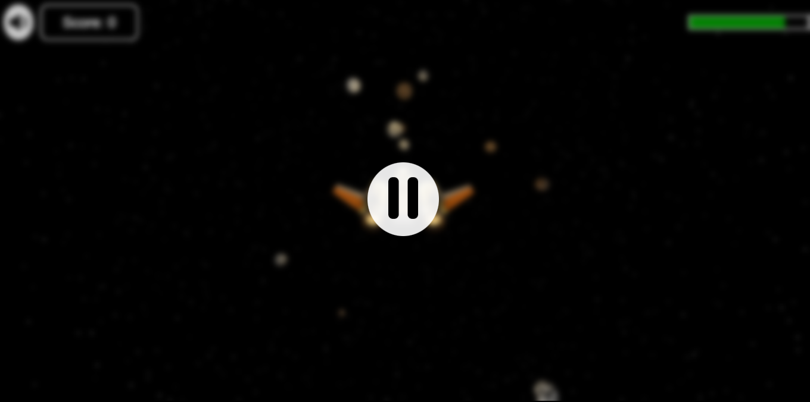
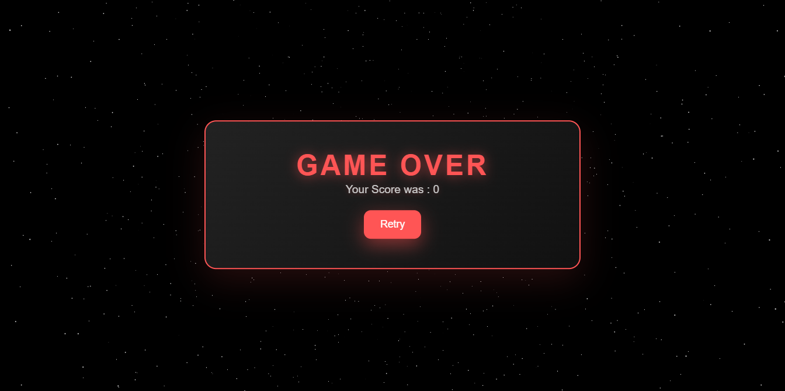
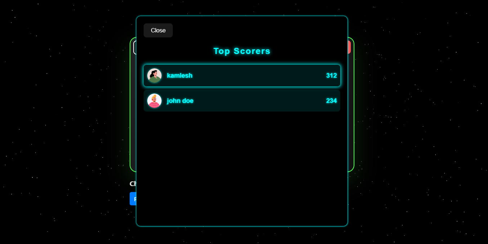

# 🚀 Space Explorer Game

An immersive 3D space adventure game built with **React**, **@react-three/fiber**, and **Firebase**.  
Fly through the stars, dodge obstacles, and challenge yourself to beat your high score.

---

## 🌌 Features

- 🛸 Choose from multiple spaceships
- 🌠 Navigate through a starfield with 3D controls
- 🔥 Real-time score and game over logic
- 🧠 High score saved using Firebase Firestore
- 👤 Simple login system with avatar generation
- 📱 Responsive UI and controls
- 🎵 Game over sound effects

---

## 📸 Screenshots

| Login | Game Start | In-Game | Pause | Game Over | Leaderboard |
|-------|------------|---------|-------|-----------|-------------|
|  |  |  |  |  |  |

---

## 🧑‍🚀 How to Play

1. Enter a unique username and password to start.
2. Select your spaceship.
3. Click **Start Game** and navigate through space.
4. Destroy obstacles and score points.
5. Game ends on when health is 0. Retry and beat your high score!

---

## ⚙️ Tech Stack

- **React + Vite**
- **@react-three/fiber** (Three.js wrapper)
- **@react-three/drei** (useful 3D helpers)
- **Firebase Firestore & Auth**
- **HTML + CSS + JavaScript**

---

